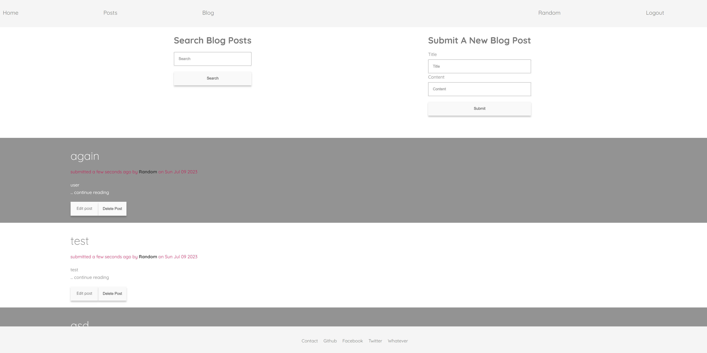
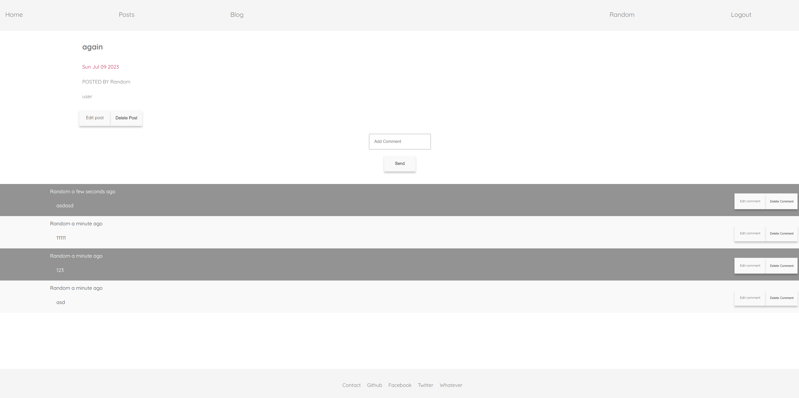

# Fullstack REST site.

~~Live demo - https://dashboard.heroku.com/apps/madbence-blog~~

My intro to Fullstack web dev with insane sentimental value.

Some salvaged variations in dump https://github.com/Bembit/dump-fullstack

NodeJS Express EJS and Mongodb.

- Authentication, user authorization/roles
- API and routing
- CRUD with Mongodb
- Image uploads

Archived, depcrecated, Heroku free dynos gone.
